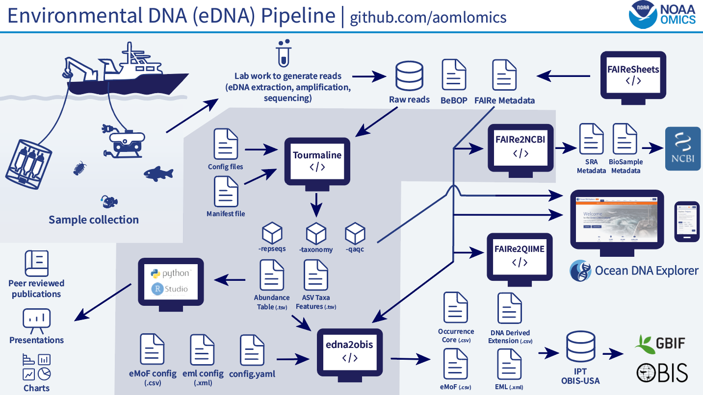

Metadata Guidelines
======

Metadata are contextual data about your experimental data. Metadata are the who, what, when, where, and why of these data. Metadata put these data into context. For 'omics studies, metadata include information about the sample: when it was collected, where it was collected from, what kind of sample it is, and what were the properties of the environment or experimental condition from which the sample was taken. Information about sample processing is also metadata: methods used to extract and purify molecules (e.g., DNA) from the sample, type of DNA sequencing or other ’omics analyses done, and where the raw experimental data are located.

For an 'omics study, metadata exist at multiple stages along the path from samples to analysis. For example, contextual information about when and where the sample was collected could include descriptors like date, time, and geospatial coordinates. Processing the sample in the lab for analysis requires different protocols and instrumentation. Once these data become electronic and are analyzed, the results should be accompanied by the versioned software used.

Metadata can also refer to information about the study itself and where the data can be found (both online and offline) in order for potential users to discover, access, evaluate, and use the data. Metadata of this type is required by the [NOAA Data Management Handbook](https://sites.google.com/noaa.gov/noaa-data/handbook) and should be hosted by NCEI.  

## Categories of metadata

### Sample metadata

Information about the primary sample: when it was collected (e.g., date and time), where it was collected from (e.g., latitude, longitude, elevation/depth, site name, country, etc.), what kind of sample it was (e.g., soil, seawater, feces), and the properties of the environment during collection (e.g., temperature, salinity, pH) or experimental condition (e.g., experimental or control, disease state) from which the sample was taken. Sample metadata are not dependent on how the sample was processed; that is called preparation metadata (see next item).

*Most of this would not be considered metadata in the strict (non-omics) sense. It is data, but it is used as contextual data for the omics data.* 

### Experimental metadata

* **Preparation metadata**: how samples were extracted, how samples were sequenced; this is specified by the MIxS 
* **Data processing/analysis metadata**: data about processing from raw sequences to desired outputs (e.g., sequence properties, software versions, processing parameters    
* **Feature metadata**: ID number, assembled sequences, assigned taxonomy/function/genome location 

<!-- ### Project metadata  -->

## Recording metadata

Planning how and what metadata is recorded in a standardized way from the start of every project will go a long way towards saving time when submitting your data to data repositories, as well as improving overall research reproducibility. Using standardized [templates](https://noaa-omics-dmg.readthedocs.io/en/latest/study-data-templates.html) early in the data collection process can help tremendously. Typically, each individual sample is recorded as a row and metadata attributes for each sample are recorded in columns. The specific metadata attributes will vary depending on your 'omics method, but generally the sample metadata should contain the minimum, yet comprehensive information about the physical and chemical conditions of the sample, from collection through sequencing. A (non-comprehensive) list could include sampling environment, molecular lab procedure names, sequencing platform and model (required by NCBI SRA), and data processing steps, and external identifications from additional processing steps, e.g. sample IDs from a sequencing organization. 

Metadata should be collated from primary sources (e.g., paper notes, emails, external collaborators, lab notebooks) and associated with sample IDs as soon as possible after it is generated. Primary sources of metadata should be backed up in case they are needed as a reference later. During this stage, the metadata should be evaluated for potential errors (e.g., incorrect GPS coordinates, missing data) and followed up on with the original data collector.

## Metadata formats and custom fields

While templates from NCBI provide some information of formatting and support the minimum metadata required for submission, we highly recommend providing additional metadata following relevant standards such as [Darwin Core](https://dwc.tdwg.org/terms/) for biodiversity observations and [FAIRe](https://fair-edna.github.io/index.html) for eDNA data. Check out the [Study Data Templates](https://noaa-omics-dmg.readthedocs.io/en/latest/study-data-templates.html) section for templates to help use these terms. 

## FAIRe eDNA Metadata Standards

<figure>
  
  <figcaption><strong>Figure 1.</strong> The FAIR eDNA workflow at NOAA AOML, showing inputs and outputs for each open-source software tool. A NOAA Omics product, funded by NOAA Ocean Exploration, in partnership with NOAA Atlantic Oceanographic and Meteorological Laboratory (AOML) and the Northern Gulf Institute, Mississippi State University.</figcaption>
</figure>

The [FAIRe (Findable, Accessible, Interoperable, Reusable) eDNA initiative](https://fair-edna.github.io/index.html) is an international, multi-organizational collaboration that has developed comprehensive metadata standards specifically for eDNA data. The FAIRe metadata checklist includes **337 data terms** organized into workflow sections such as sample collection, PCR, and bioinformatics, with terms classified as:

- **38 mandatory terms** — required for all submissions
- **51 highly recommended terms** — strongly encouraged for data quality
- **128 recommended terms** — improve interoperability
- **120 optional terms** — for specialized applications

The FAIRe standard draws from established data sources including MIxS (Minimum Information about any Sequence), Darwin Core (for biodiversity data), MIQE guidelines (for quantitative PCR), MIEM guidelines (for eDNA metabarcoding), and 158 new terms developed specifically for eDNA procedures. This comprehensive approach ensures eDNA datasets are consistently documented, discoverable, and reusable across the scientific community, supporting data-driven biodiversity management at broad scales and enabling cross-discipline reuse.

For information on the FAIRe data standard itself, use the [FAIR eDNA website](https://fair-edna.github.io/index.html) and the [FAIR eDNA GitHub organization](https://github.com/FAIR-eDNA).

A great way to get started is to watch the [FAIR eDNA Workshop: Mobilizing Data from Standards to Sharing](https://www.youtube.com/playlist?list=PLS6jqgZoUzto) series from [OBON](https://obon-ocean.org/), which covers the complete workflow from the data standard, generating and filling in your own data templates, and publication to repositories like [OBIS](https://obis.org/), [GBIF](https://www.gbif.org/), [NCBI](https://www.ncbi.nlm.nih.gov/), and the [Ocean DNA Explorer](https://www.oceandnaexplorer.org/).

Workshop workflow components in order:

1. **FAIRe-ator** - Generate customized FAIRe Excel templates (R). [Tutorial](https://www.youtube.com/watch?v=gnk77IJ-X58&list=PLS6jqgZoUzto&index=3&t=12s)
2. **FAIReSheets** - Generate Google Sheets templates in FAIRe and FAIRe-NOAA formats (Python). [Tutorial](https://www.youtube.com/watch?v=dE2g6FswuA0&list=PLS6jqgZoUzto&index=6&t=52s)
3. **FAIRe-fier** - Verify FAIRe metadata against checklist rules. [Tutorial](https://www.youtube.com/watch?v=56tY3XEVvzA&list=PLS6jqgZoUzto&index=5&t=97s)
4. **BeBOP-OBON templates** - Document methods using [BeBOP-OBON Protocol Collection Template](https://github.com/BeBOP-OBON/0_protocol_collection_template) and [Minimum Information about an Omics Protocol](https://github.com/BeBOP-OBON/miop). [Tutorial](https://www.youtube.com/watch?v=DupsGaYPvhw&list=PLS6jqgZoUzto&index=9)
5. **FAIRe2QIIME** - Convert FAIRe-aligned inputs for QIIME-based analysis workflows. [Tutorial](https://www.youtube.com/watch?v=xyV6Mya_OYc&list=PLS6jqgZoUzto&index=7&t=2s)
6. **Tourmaline** - Run QIIME 2 + Snakemake amplicon processing to generate analysis outputs, including ASV feature/taxonomy and abundance tables.
7. **Ocean DNA Explorer (ODE)** - Submit and explore standardized eDNA project data (metadata plus analysis-linked ASV tables). [Submission Guidelines](https://www.oceandnaexplorer.org/help)
8. **FAIRe2NCBI** - Convert FAIRe-NOAA metadata to NCBI BioSample and SRA templates. [Tutorial](https://www.youtube.com/watch?v=xyV6Mya_OYc&list=PLS6jqgZoUzto&index=7&t=2s)
9. **edna2obis** - Convert FAIRe-based eDNA data to Darwin Core outputs for OBIS and GBIF. [Tutorial](https://www.youtube.com/watch?v=bhNuE15icpQ&list=PLS6jqgZoUzto&index=11)

### Generating FAIRe Templates with FAIReSheets

[FAIReSheets](https://github.com/aomlomics/FAIReSheets) is NOAA's Python-based tool for generating standardized eDNA metadata templates directly in Google Sheets, based on the FAIRe NOAA checklist (data dictionary). [FAIReATOR](https://github.com/FAIR-eDNA/FAIRe-ator/tree/main) is a similar tool which creates FAIRe metadata templates in Excel, using R. However, FAIReATOR cannot created FAIRe-NOAA templates. 

**Key features:**

- **Custom User-Defined Terms** — Add domain-specific fields to the checklist before template generation; these automatically appear in your Google Sheets
- **Controlled Vocabularies** — Pre-defined vocabularies for many fields ensure consistent data entry and units of measure across the eDNA community
- **Ready for Submission** — Generated templates are formatted for immediate submission to the Ocean DNA Explorer, and can also be adapted for OBIS and GBIF using the edna2obis tool

**To access FAIReSheets:** This tool is available upon request. Contact bayden.willms@noaa.gov for access and guidance.

The templates generated include metadata for:
- **Project metadata** — overarching study information
- **Sample metadata** — collection details and sample characteristics
- **Experiment run metadata** — PCR and preparation procedures
- **Analysis metadata** — bioinformatics processing and results

### Filling in FAIRe Metadata Templates

Once you have generated your templates through FAIReSheets, the next step is to populate them with your project data. This is a critical step to ensure your data is standardized, interoperable, and discoverable.

**Best practices for completing templates:**

1. **Link your records** — Use consistent project IDs, sample IDs, and analysis run names across all metadata files to establish relationships between data layers
2. **Distinguish project vs. assay-specific data** — Some fields in project metadata apply to all analyses (marked in the project_level column), while others are assay-specific (e.g., "ssu16sv4v5-emp" or "ssu18sv9-emp")
3. **Leverage controlled vocabularies** — Use the predefined terms and units provided in the checklist to maintain consistency
4. **Document everything** — Even fields that seem obvious now may be unclear to future data users or collaborators
5. **Validate before submission** — Check for inconsistencies, missing required fields, and formatting errors before uploading

### Handling Missing Data (Dead Values)

Data absence is common and occurs for many legitimate reasons — location information may be intentionally obscured to protect endangered species or culturally sensitive sites, certain measurements may not be applicable to a sample type, or data collection may have been missed due to circumstances beyond your control.

For required fields that lack data, you must specify **why** the information is unavailable using the INSDC missing value controlled vocabulary. This practice is also recommended for optional fields. Rather than leaving cells empty, select the most appropriate "dead value" from the following list:

| Value to Enter | When to Use |
| --- | --- |
| `missing` | Data are missing (unspecified reason) |
| `not applicable` | Field does not apply to this sample |
| `not collected` | Data were not collected |
| `not provided` | Data exist but were not provided |
| `restricted access` | Data cannot be shared due to access restrictions |

Our "dead values" terminology maps to the [INSDC missing value reporting standard](https://www.insdc.org/technical-specifications/missing-value-reporting/).

### User-Defined Terms

If your project requires data fields not present in the FAIRe NOAA checklist, you can add them as **User-Defined Terms**. These custom fields can be:

- **Added before template generation** — Modify the FAIRe NOAA checklist Excel file to include your custom terms before running FAIReSheets; they will automatically populate in your generated Google Sheets
- **Added manually after generation** — Insert new columns directly into your Google Sheet with your custom field names and metadata

User-Defined Terms should follow the same naming and documentation conventions as standard FAIRe terms to maintain data consistency and usability.

### Project Structure and Data Relationships

Understanding how your metadata files relate to each other is essential for proper data organization and submission.

| Metadata File Type | Purpose | Key Identifiers | Can Submit Independently? |
| --- | --- | --- | --- |
| **Project Metadata** | Overarching study information, PCR targets, assay details | project_id, assay_type, assay_name | No — requires analysis file(s) |
| **Sample Metadata** | Collection details, sample characteristics, environmental conditions | project_id, sample_id | No — requires project metadata |
| **Experiment Run Metadata** | PCR procedures, primers, thermocycler conditions | project_id, experiment_run_id | No — requires project metadata |
| **Analysis Metadata** | Bioinformatics pipeline, version numbers, processing parameters | project_id, analysis_run_name | Yes — if project already exists in Ocean DNA Explorer |

**Critical linking fields:**

- **project_id** — Must be identical across all metadata files to link sample, experiment, and analysis data to the same project
- **analysis_run_name** — Must be unique for each analysis and correctly specified in all analysis metadata files
- **sample_id** — Links samples to their collection metadata and experimental processing

### Required Fields for Submission

The following fields are **mandatory** for each submission type. All files must be in **TSV (Tab-Separated Values) format** and follow the FAIRe template structure exactly.

#### Project Metadata Requirements

| Required Field | Description |
| --- | --- |
| `project_id` | Unique identifier for the project; must match across all related files |
| `project_contact` | Name and contact information for the project lead |
| `assay_type` | Target marker or marker group (e.g., "16S rRNA", "18S rRNA", "COI") |
| `assay_name` | Descriptive name for the specific assay (e.g., "ssu16sv4v5-emp") |
| `checkls_ver` | Version of the FAIRe checklist used |
| `pcr_0_1` | PCR cycle information or PCR primer information |
| `targetTaxonomicAssay` | Taxonomic target of the assay (e.g., bacteria, fungi, eukaryotes) |
| `pcr_primer_forward` | Forward primer sequence or reference |
| `pcr_primer_reverse` | Reverse primer sequence or reference |

#### Analysis Metadata Requirements

| Required Field | Description |
| --- | --- |
| `project_id` | Must match the project_id in the project metadata file |
| `assay_name` | Must match the assay_name from project metadata |
| `analysis_run_name` | Unique name for this specific analysis run; used to distinguish multiple analyses of the same project |

### Submitting Data to the Ocean DNA Explorer

Once you have completed your metadata templates:

1. **Export as TSV**: Download each sheet from your Google Sheets template as a TSV file
2. **Validate structure**: Verify all required fields are present and populated
3. **Check identifiers**: Ensure project_id, sample_id, and analysis_run_name are consistent across files
4. **Prepare analysis inputs**: For each analysis run, include:
   - `analysisMetadata` (often generated from Tourmaline configs; see [Tourmaline README](https://github.com/aomlomics/tourmaline/blob/develop/README.md))
   - ASV taxonomy features table (for example: `featureid`, DNA sequence, taxonomy, and rank fields)
   - ASV abundance table (sample-by-feature count table keyed by `featureid`)
5. **Submit files**: Upload metadata and analysis-linked ASV files on the [Ocean DNA Explorer submission page](https://www.oceandnaexplorer.org/submit)

Detailed submission instructions are available on the [Ocean DNA Explorer submission page](https://www.oceandnaexplorer.org/submit). For a concrete example of ODE-compatible raw ASV taxonomy and abundance inputs, see the [edna2obis README](https://github.com/aomlomics/edna2obis/blob/main/README.md).

### Submitting to OBIS and GBIF

If you plan to submit your eDNA data to [OBIS (Ocean Biodiversity Information System)](https://obis.org/) or [GBIF (Global Biodiversity Information Facility)](https://www.gbif.org/), NOAA Omics has developed the **edna2obis** Python workflow to convert Ocean DNA Explorer input files to the format required by these repositories.

Because edna2obis uses the same input file structure as the Ocean DNA Explorer, if your data is properly formatted for Ocean DNA Explorer submission, it can be easily adapted for OBIS and GBIF submission as well. This allows you to maximize the reach and impact of your eDNA data across multiple biodiversity platforms.

For more information on preparing eDNA data for OBIS/GBIF, consult the [edna2obis GitHub repository](https://github.com/aomlomics/edna2obis) and the [GBIF guide to publishing DNA-derived data](https://docs.gbif.org/publishing-dna-derived-data/en/).

## Refining metadata to a standard

Standardizing the format of your metadata can both facilitate sharing of your results with others and improve identification of errors within your own metadata. Having a method-specific template Google Sheet or Excel file for metadata that you use across all similar studies can be very helpful. This template should include a second sheet or file with a "data dictionary" defining the desired attribute columns and formats. Refining your metadata to a standard has benefits for internal use, publication, and repository submission. Refined metadata should have the following characteristics:

1. Standardized: The data in each column should be written in a consistent manner, i.e. in the same format. 
2. Well-defined attributes: The names of the metadata parameters of each sample should be obvious in definition, with units included if applicable.
3. Collected metadata should be comprehensive, but not with extraneous or unnecessary attributes.

A general workflow for transforming and refining metadata:

1. Fill in missing metadata: consult cruise/ship notes and other potential sources of unconsolidated information about the samples. For missing data that cannot be filled in, we recommend following the [INSDC standardized missing value reporting language](https://ena-docs.readthedocs.io/en/latest/submit/samples/missing-values.html).
2. Identify the columns that are present and compare that with those in the data dictionary, given that those are the minimum amount of information that we hope to submit with the dataset that we make publicly available.
3. Standardize the data to that of the column headers’ standards. 
4. Optional: input columns to relational database
5. Publish data to NCEI and other potential funding specific sites

## Submitting metadata and environmental data to repositories

NOAA ’Omics projects should make their metadata and non-’omics data (non-“big data”) publicly accessible to the appropriate repositories (also see [Table 1](https://noaa-omics-dmg.readthedocs.io/en/latest/omics-data-guidelines.html#table-1-data-repositories)). Please note that, although NOAA's Coral Reef Information System ([CoRIS](https://www.coris.noaa.gov/data/supportingdocs.html)) is the preferred venue for archiving NOAA-funded coral reef data, all CoRIS submissions are handled by NCEI.

| Project type          | Metadata repositories     | 
| --------------------- | ------------------------- | 
| Environmental survey  | [OBIS/GBIF](https://noaa-omics-dmg.readthedocs.io/en/latest/metadata-guidelines.html#submitting-to-biodiversity-repositories-obisgbif) or directly to [NCEI](https://www.ncei.noaa.gov/archive); [NCBI](https://www.ncbi.nlm.nih.gov/sra/docs/submit/#accepted-data)               |
| Mesocosm experiment   | [NCEI](https://www.ncei.noaa.gov/archive) & [NCBI](https://www.ncbi.nlm.nih.gov/sra/docs/submit/#accepted-data)                 |
| Laboratory experiment | [NCBI](https://www.ncbi.nlm.nih.gov/sra/docs/submit/#accepted-data)                        |
| Genome/reference sequencing | [NCBI](https://www.ncbi.nlm.nih.gov/sra/docs/submit/#accepted-data)                  |
| Non-DNA/RNA data (e.g.: metabolomics, proteomics) | Specialized repository and/or [NCEI](https://www.ncei.noaa.gov/archive) (if environmental), [NCBI](https://www.ncbi.nlm.nih.gov/sra/docs/submit/#accepted-data)  |
| Coral reef data | [CoRIS](https://www.coris.noaa.gov/data/supportingdocs.html) (via [NCEI](https://www.ncei.noaa.gov/archive)), with cross-linking to relevant data repository |

<!--
Can we submit metadata to BioSample without sequence data?
\!-->

### Use GCMD keywords in project metadata  

Whenever you submit metadata about a project to a repository, if there is a field for keywords we recommend using a controlled vocabulary such as the [Omics terms in the NASA Global Change Master Directory (GCMD)](https://gcmd.earthdata.nasa.gov/KeywordViewer/scheme/Earth%20Science/8eb84f36-f355-458b-889f-b37cfa120654?gtm_keyword=OMICS&gtm_scheme=Earth%20Science). GCMD keywords are a hierarchical set of controlled Earth Science vocabularies that help ensure Earth science data, services, and variables are described in a consistent and comprehensive manner and allow for the precise searching of metadata and subsequent retrieval of data, services, and variables. 

### NCEI

Send metadata and environmental data to the [National Centers for Environmental Information (NCEI)](https://www.ncei.noaa.gov/), generally excluding ’omics data, as these large datasets should be stored in the relevant [long-term data repository](https://noaa-omics-dmg.readthedocs.io/en/latest/omics-data-guidelines.html#table-1-data-repositories) and linked from NCEI to those records with persistent identifiers. Although NCEI can curate ’omics datasets smaller than 20 GB (i.e., most proteomic and metabolomic datasets), it does not permit the critically important interactive querying feature that is integral to all ’omics-tailored data repositories and so should not be the lone repository for ’omics data. We highly recommend submitting metabarcoding ASV tables to OBIS/GBIF (see next section).

### Submitting to biodiversity repositories (OBIS/GBIF)

[GBIF](https://www.gbif.org/) and [OBIS](https://obis.org/) are global repositories of biodiversity data, and are actively interested in expanding access to eDNA observations. OBIS has the benefit of archiving data to NCEI for you. 

NOAA Omics has developed a Python workflow for preparing data for submission to OBIS/GBIF, called [edna2obis](https://github.com/aomlomics/edna2obis). We also have a [tutorial](https://www.youtube.com/watch?v=bhNuE15icpQ&list=PLS6jqgZoUzto&index=11) available to help you use edna2obis.

GBIF also has a non-coding [prototype GUI tool](https://edna-tool.gbif-uat.org/) to prepare eDNA data for GBIF/OBIS.  

For general guidance on preparing data for OBIS/GBIF, check out the guide entitled "[Publishing DNA-derived data through biodiversity data platforms](https://docs.gbif.org/publishing-dna-derived-data/en/)."

OBIS also has a free self-paced [course](https://oceanexpert.org/event/3983) for preparing and submitting data, including a module on DNA-derived data.

### Domain-specific databases 

* Ocean acidification (OA) data generated through the Ocean Acidification Program (OAP) should be submitted to a special section of NCEI, the [Ocean Acidification Data Stewardship (OADS) Project](http://www.nodc.noaa.gov/oceanacidification).  
* Coral and coral reef data should be sent to NCEI, where it will then be posted on NCEI and referenced/cross-listed by NOAA’s [Coral Reef Information System (CoRIS)](https://www.coris.noaa.gov/).
* [Earth Science Information Partners (ESIP)](https://www.esipfed.org/esip-endorsed) Biological Data Standards.  
* [International Organization for Standardization (ISO)](https://www.iso.org/) standards with guidance from NOAA’s [National Centers for Environmental Information (NCEI)](https://www.ncei.noaa.gov/).

### Metadata standards

Environmental metadata should be formatted according to one or more of the following standards:  
* [ISO I9115-2](https://www.ncei.noaa.gov/sites/default/files/2020-04/ISO%2019115-2%20Workbook_Part%20II%20Extentions%20for%20imagery%20and%20Gridded%20Data.pdf)
* Water samples (NOAA Omics standard): [Study Data template - Water](https://docs.google.com/spreadsheets/d/1YBXFU9PuMqm7IT1tp0LTxQ1v2j0tlCWFnhSpy-EBwPw/edit?usp=sharing)
* General ’omics projects: [Genomics Standards Consortium (GSC) Minimum Information about any (x) Sequence (MIxS)](https://github.com/GenomicsStandardsConsortium/mixs/wiki).
* OAP-funded projects: [Ocean Acidification Data Stewardship (OADS)](https://www.ncei.noaa.gov/products/ocean-carbon-acidification-data-system) metadata guidelines.
* Additional guidance from [ENA](https://ena-docs.readthedocs.io/) (European Nucleotide Archive), including [The ENA Metadata Model — ENA Training Modules 1 documentation](https://ena-docs.readthedocs.io/en/latest/submit/general-guide/metadata.html) and [Reporting Missing Values — ENA Training Modules 1 documentation](https://ena-docs.readthedocs.io/en/latest/submit/samples/missing-values.html). 

### Timing of submission

The suggested deadline for data to be published and accessible in NCEI is one year after the end date of the project for NOAA intramural PIs, two years after the end date of the project for extramural PIs, or before a paper is published using these data (whichever is sooner). This schedule is based on the [OAP Data Management Agreement](https://www.ncei.noaa.gov/products/ocean-carbon-acidification-data-system).  

**Point of contact for submissions**: The PI is responsible for working with NCEI to publish the data in a timely manner.  

## Useful links

Metadata guides  
  + [National Microbiome Data Collaborative (NMDC)](https://microbiomedata.org/introduction-to-metadata-and-ontologies/) -- covers additional metadata
  + [Earth Microbiome Project (EMP)](https://earthmicrobiome.org/protocols-and-standards/metadata-guide/)

Metadata standards  
  + [GSC defined terms](https://www.gensc.org/pages/standards/all-terms.html)
  + [Biosample Attributes](https://www.ncbi.nlm.nih.gov/biosample/docs/attributes/)
  + [BeBOP-OBON Protocol Collection Template](https://github.com/BeBOP-OBON/0_protocol_collection_template)
  + [BeBOP-OBON Minimum Information about an Omics Protocol](https://github.com/BeBOP-OBON/miop)
  + [GBWG - Sustainable DarwinCore MIxS Interoperability - TDWG](https://www.tdwg.org/community/gbwg/mixs/)
  + [GenBank templates](https://submit.ncbi.nlm.nih.gov/templates/)
  + [NIH tool to format all types of metadata](https://metagenote.niaid.nih.gov/)
